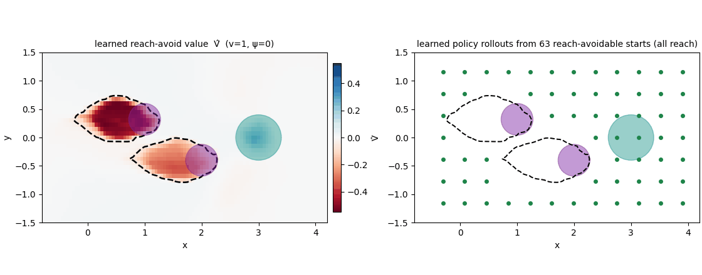

<div align="center">

# Safety Stable-Baselines3

**Train reinforcement-learning policies that come with a learned safety certificate** —
Hamilton–Jacobi safety, reach-avoid, and adversarial safety RL, as a lightweight add-on to
[Stable-Baselines3](https://stable-baselines3.readthedocs.io/).

[](https://saferoboticslab.github.io/safety-stable-baselines/)
[](https://github.com/SafeRoboticsLab/safety-stable-baselines/releases)
[](https://www.python.org/)
[](LICENSE)

### [📖 Read the documentation →](https://saferoboticslab.github.io/safety-stable-baselines/)

[Installation](https://saferoboticslab.github.io/safety-stable-baselines/getting-started/installation/) ·
[Quickstart](https://saferoboticslab.github.io/safety-stable-baselines/getting-started/quickstart/) ·
[Choose a learner](https://saferoboticslab.github.io/safety-stable-baselines/getting-started/choose-a-learner/) ·
[Oracle validation](https://saferoboticslab.github.io/safety-stable-baselines/validation-oracle/) ·
[Migration guide](RELEASE_NOTES.md)



*The reach-avoid **value** `safety_sb3` learns on `bicycle5d` (left; its zero level set is an online
safety certificate) and the learned policy reaching the goal from across the map (right) — validated
against a Hamilton–Jacobi oracle.*

</div>

> ### 📣 August 2026 — v0.4.0 is released!
> The **MAP rename** (Mode·Algorithm·Players — every learner's name now encodes its algorithm), a
> **certificate-soundness fix** (the entropy bonus is gone from the safety Bellman target, validated
> against an HJ oracle), a **CUDA-graph SAC** speedup, and a rebuilt documentation site.
> **This is a breaking release** — see the [migration guide](RELEASE_NOTES.md); pin `@v0.3.0` for the
> old class names.

## What is this?

`safety_sb3` learns a **value function whose sign is a safety certificate**: `V(s) ≥ 0` marks the
states from which the policy can stay safe forever (or, for reach-avoid, reach a target while staying
safe). You hand the environment a **safety margin** `g(s)` instead of a reward, swap the learner class,
and train exactly as you would in SB3.

**Design principle — keep upstream SB3 untouched.** Everything lives in this separate package and
still feels native: same constructors, same `learn()`, same callbacks and loggers.

It implements three families of safety RL, plus a GPU-resident path for massively-parallel simulators:

| | |
|---|---|
| 🛡️ **Stay safe** | Learn a policy + certificate `V ≥ 0` that keeps the system out of a failure set forever. *(HJ safety RL, Fisac et al. ICRA'19)* |
| 🎯 **Reach a goal safely** | Reach a target set while never leaving the safe set. *(Reach-avoid RL, Hsu et al. RSS'21)* |
| ⚔️ **Be robust to disturbances** | Train against a worst-case disturbance adversary — a zero-sum game whose value is a robust certificate. *(ISAACS, Hsu, Nguyen et al. L4DC'23)* |
| ⚡ **Scale on the GPU** | A tensor-native path (`TensorVecEnv`) keeps thousands of parallel envs on-device — no NumPy round-trip on the hot path. |

## Documentation

📖 **https://saferoboticslab.github.io/safety-stable-baselines/** is the canonical reference —
installation, a tested quickstart, "choose a learner", the environment contract, the MAP naming law,
the backup operators, the Hamilton–Jacobi **oracle-validation study**, and the API reference. **Start
there.**

## Install

Not on PyPI — install from Git (Python ≥ 3.10):

```bash
git clone git@github.com:SafeRoboticsLab/safety-stable-baselines.git
cd safety-stable-baselines && pip install -e .
```

Depend on it from another project via a **pinned** Git tag (the tag matters — `v0.4.0` is a breaking
rename; pin `@v0.3.0` for the old names):

```
safety_sb3 @ git+https://github.com/SafeRoboticsLab/safety-stable-baselines.git@v0.4.0
```

## Quickstart

Wrap any Gym env so the reward channel carries the safety margin `g(s)` and breaches terminate:

```python
import gymnasium as gym, numpy as np
from safety_sb3 import SafetySAC1P

class PendulumSafety(gym.Wrapper):
    """Reward == safety margin g(s) = pi/6 - |theta|  (safe iff |theta| <= 30 deg)."""
    def step(self, action):
        obs, _, terminated, truncated, info = self.env.step(action)
        theta = np.arctan2(obs[1], obs[0])
        g = np.pi / 6 - abs(theta)
        return obs, float(g), terminated or g < 0.0, truncated, info

model = SafetySAC1P("MlpPolicy", PendulumSafety(gym.make("Pendulum-v1")), gamma=0.995, verbose=1)
model.learn(100_000)          # the trained critic is your certificate: V(s) >= 0 == stay-safe set
```

For reach-avoid, additionally return the target margin on `info["l_x"]` and train `ReachAvoidSAC1P` /
`ReachAvoidPPO1P` — only the class name changes. Full walkthrough:
[Quickstart](https://saferoboticslab.github.io/safety-stable-baselines/getting-started/quickstart/).

## Choose a learner — the MAP

Every class name is three axes — **M**ode · **A**lgorithm · **P**layers — and nothing else, so the
roster is just their product:

```
M = Mode       Safety | ReachAvoid | Cumulative    (which Bellman operator)
A = Algorithm  PPO | SAC | A2C | DQN               (which RL method)
P = Players    1P | 2P                             (single | zero-sum game)
```

| Algorithm | `Safety` (stay safe ∀t) | `ReachAvoid` (reach, staying safe) | `Cumulative` (ordinary RL) |
|---|---|---|---|
| **PPO** | `SafetyPPO1P` `SafetyPPO2P` | `ReachAvoidPPO1P` `ReachAvoidPPO2P` | `CumulativePPO1P` |
| **SAC** | `SafetySAC1P` `SafetySAC2P` | `ReachAvoidSAC1P` `ReachAvoidSAC2P` | `CumulativeSAC1P` |
| **A2C** | `SafetyA2C1P` | `ReachAvoidA2C1P` | `CumulativeA2C1P` |
| **DQN** | `SafetyDQN1P` | — *(discrete replay carries no `l`)* | `CumulativeDQN1P` |

Pick the **Mode** by the problem — the three take genuinely different value operators, and *avoid is
not expressible as a reach-avoid instance*. The full naming law, the backup operators
(`min(g, max(l, V'))` and friends), `terminal_type`, and the environment `(g, l)` contract are on the
[MAP convention](https://saferoboticslab.github.io/safety-stable-baselines/map/) and
[Backups](https://saferoboticslab.github.io/safety-stable-baselines/concepts/backups/) pages.

## Validated against a Hamilton–Jacobi oracle

On `bicycle5d`, the learned reach-avoid certificate is checked against the exact HJ reach-avoid set
computed with a numerical solver: it is **sound** (when it says a state is safe-reachable, the policy
reaches without failing **98%** of the time) and a **conservative subset** of the true set. See the
[oracle-validation study](https://saferoboticslab.github.io/safety-stable-baselines/validation-oracle/).

## Tests

```bash
pip install pytest && python -m pytest tests/ -q
```

Covers the Bellman recursions, the MAP taxonomy (names ↔ `_MODE`/players, roster = product, DQN
refuses reach-avoid), on-policy + tensor-path smoke training, the abstract-DP dispatch, and the
two-player per-network LR/entropy controls.

## Citation

If you use this library, please cite the software:

```bibtex
@misc{nguyen2026safetySB3,
  author       = {Nguyen, Duy P. and Hu, Haimin and Fisac, Jaime F.},
  title        = {{Safety-SB3: Scalable Safety and Reach-Avoid Reinforcement Learning with Stable-Baselines3}},
  year         = {2026},
  howpublished = {\url{https://github.com/SafeRoboticsLab/safety-stable-baselines}},
  note         = {Version 0.4.0, computer software}
}
```

and the relevant method:

- J. Fisac et al., "[Bridging Hamilton-Jacobi Safety Analysis and Reinforcement Learning](https://ieeexplore.ieee.org/document/8794107)," ICRA 2019.
- K.-C. Hsu, V. Rubies-Royo, C. Tomlin, J. Fisac, "[Safety and Liveness Guarantees through Reach-Avoid Reinforcement Learning](https://arxiv.org/abs/2112.12288)," RSS 2021.
- K.-C. Hsu\*, D. P. Nguyen\*, J. Fisac, "[ISAACS: Iterative Soft Adversarial Actor-Critic for Safety](https://arxiv.org/abs/2212.03228)," L4DC 2023.

## License

[MIT](LICENSE) © Safe Robotics Lab, Princeton University.
