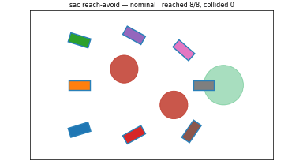
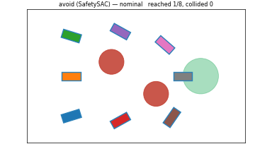
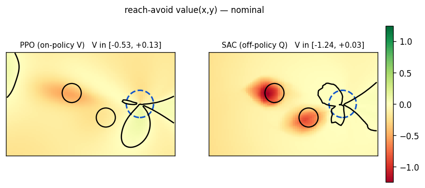

# Bicycle5D — drive to a goal, avoid obstacles

A 5-D kinematic bicycle (Princeton race car) in a plane of circular obstacles
with a circular goal. Small, numpy-only, and **CPU-trainable to convergence in
minutes** — the library's reference validation env.

It's built to make the difference between the two problems *visible*:

- **avoid** (`SafetySAC` / `SafetyPPO`): nothing rewards motion, and `g > 0` is
  already satisfied where the car starts — so the optimal policy is to **sit
  still** (and only swerve if something approaches). The negative control.
- **reach-avoid** (`ReachAvoidSAC` / `ReachAvoidPPO`): drive to the goal from
  anywhere on the map without hitting an obstacle.

`reach_rate(reach-avoid) ≫ reach_rate(avoid)` is the whole assertion — and it is
exactly what a wrong reach-avoid anchor fails (a `g`-anchored backup values
sitting still at `V = g > 0`, so its "reach-avoid" car sits still too). See
[RELEASE_NOTES](../release-notes.md).

`import safety_sb3.testing.bicycle5d` — `BicycleGoal` (single-env gym) and
`BicycleGoalVec` (batched, ~50k steps/s on CPU).

---

## Results

Trained from **full-map spawns** (cars start all over the map) and evaluated on 8
spawns × 4 unseen layouts. Reach-avoid reaches from every region; avoid sits
still.

<div class="grid" markdown>

**Reach-avoid — cars reach from anywhere**

{ width="480" }

**avoid — cars stay put (the control)**

{ width="480" }

</div>

**Coverage:** `ReachAvoidSAC` 100%, `ReachAvoidPPO` 97% (from standstill, over the
32 eval cars); avoid 0%.

### The learned value function `V(x, y)`

`V ≥ 0` is the reach-avoid **certificate** (can reach the goal safely from here);
the black contour is its boundary, obstacles are negative wells.

{ width="640" }

The **off-policy SAC** value is the clean, calibrated one — negative *only*
around the obstacles, correct magnitude. The **on-policy PPO** value is muddy
*off its trajectory tube* (it fits `V` only where the policy goes). This is why
HJ-reachability work uses the SAC family for certificates: `V(s) = minᵢ Qᵢ(s,
π(s))` is calibrated over the action space, not just the on-policy distribution.

---

## The contract

### Observation — `4 + 2 + 3·n_obstacles` (12 for the 2 default obstacles)

All in the car's **body frame** (translation-invariant, so the policy
generalizes across the map):

| slot | content |
|---|---|
| `v` | speed |
| `sin ψ`, `cos ψ` | heading |
| `δ` | steering angle |
| `goal_x`, `goal_y` | goal position relative to the car |
| per obstacle × n | `(x, y` relative, `radius)` |

### Action — `2` (or `7` with `adversary=True`)

| | range |
|---|---|
| `accel` | `[−2, 2]` |
| `omega` (steering **rate**) | `[−2, 2]` |
| (adversary) `d[0:5]` | additive disturbance on all 5 state derivatives |

State `[x, y, v, ψ, δ]`, `v ∈ [0, 2]` (**can stop, can't reverse** — `v_min = 0`
is load-bearing: the avoid car must be *able* to sit still), `δ ∈ [±0.35]`, min
turning radius 0.70 m. RK4 integration.

### Margins (`g` on reward, `l` on `info["l_x"]`)

- **`g`** = signed distance from the car's rectangular footprint to the nearest
  obstacle circle, normalized, clamped `±3`. `g ≥ 0` ⟺ not in collision.
- **`l`** = target margin, piecewise: `+GOAL_VALUE` (0.3) at the goal centre → 0
  at the boundary → gentle negative outside. `l ≥ 0` ⟺ in the goal. The
  piecewise shape gives the value real positive range while keeping a reach
  gradient far out (a single linear scale can't do both).

---

## Run it

```python
from safety_sb3 import ReachAvoidSAC          # or ReachAvoidPPO
from safety_sb3.testing.bicycle5d_vec import BicycleGoalVec

env = BicycleGoalVec(16, spawn="wide")        # batched, full-map spawns
model = ReachAvoidSAC("MlpPolicy", env, buffer_size=500_000, learning_starts=5000,
                      batch_size=512, train_freq=(16, "step"), gradient_steps=16)
model.learn(2_000_000)                        # ~100% coverage
```

The avoid control is the same with `SafetySAC` (no `l` used). The full demo —
multi-car GIFs, value maps, and the PPO/SAC comparison — is
[`examples/bicycle5d_demo.py`](https://github.com/SafeRoboticsLab/safety-stable-baselines/blob/main/examples/bicycle5d_demo.py)
and
[`examples/bicycle5d_value_compare.py`](https://github.com/SafeRoboticsLab/safety-stable-baselines/blob/main/examples/bicycle5d_value_compare.py):

```bash
python examples/bicycle5d_demo.py --family sac --steps 2000000   # avoid + reach-avoid
python examples/bicycle5d_value_compare.py                       # PPO vs SAC value maps
```
