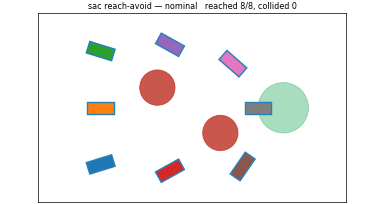

# Environments

A growing set of small, self-contained reference environments that ship with
`safety_sb3` (under `safety_sb3.testing`) — each trainable to convergence in
minutes on CPU, and each exercising the library on a problem where the right
behavior is obvious. They are the fastest way to see the algorithms work and to
validate your own setup against a known-good baseline.

For the **mjlab / GPU robot** environments (humanoid, quadruped, etc.), see
[robot-safety-sandbox](https://github.com/SafeRoboticsLab/robot-safety-sandbox)
and its own environment showreel.

-   ### [Bicycle5D](bicycle5d.md)

    { width="320" }

    A 5-D bicycle drives to a goal through circular obstacles. **avoid** sits
    still; **reach-avoid** reaches from anywhere. Includes
    the learned value-function certificate and a PPO-vs-SAC value comparison.

    `SafetyPPO1P` · `SafetySAC1P` · `ReachAvoidPPO1P` · `ReachAvoidSAC1P`

Each page follows the same shape: task definition, the observation / action /
margin contract, a few lines to launch, and the expected result (GIF + value
figure). To add one, drop a module in `safety_sb3/testing/` and a page here.
