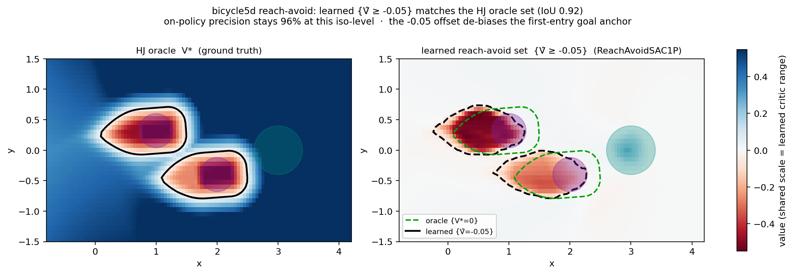

# Safety Stable-Baselines3

**Train reinforcement-learning policies that come with a learned safety certificate** — a
learned value function whose sign tells you, at every state, whether the policy can
keep the system safe. `safety_sb3` is a lightweight add-on for
[Stable-Baselines3](https://stable-baselines3.readthedocs.io/): same constructors,
same `learn()`, same callbacks — you swap the learner class and give the environment a
safety margin instead of a reward.

{ width="720" }

*The reach-avoid value learned by `safety_sb3` recovers the exact Hamilton–Jacobi
reach-avoid set computed by a numerical oracle — the certificate is **sound**, not
just plausible. [See the full validation study →](validation-oracle.md)*

It implements three families of safety RL, plus a GPU-resident path for
massively-parallel simulators:

<div class="grid cards" markdown>

-   :material-shield-check: **Stay safe**

    Learn a policy — and a certificate `V ≥ 0` — that keeps the system out of a
    failure set forever. *Hamilton–Jacobi safety RL (Fisac et al., ICRA'19).*

-   :material-target: **Reach a goal safely**

    Reach a target set while never leaving the safe set. The value function certifies
    reach-avoidability. *Reach-avoid RL (Hsu et al., RSS'21).*

-   :material-sword-cross: **Be robust to disturbances**

    Train the controller against a worst-case disturbance adversary — a zero-sum game
    whose value is a robust safety certificate. *ISAACS (Hsu, Nguyen et al., L4DC'23).*

-   :material-chip: **Scale on the GPU**

    A tensor-native path (`TensorVecEnv`) keeps rollouts on-device for thousands of
    parallel envs (mjlab / Isaac-style), with no NumPy round-trip on the hot path.

</div>

## Install and run in five minutes

```bash
pip install "safety_sb3 @ git+https://github.com/SafeRoboticsLab/safety-stable-baselines.git"
```

`safety_sb3` is not on PyPI — install from Git (see [Installation](getting-started/installation.md)
for the version pin and the editable/contributor setup). Then train a safety policy on
`Pendulum-v1`, where the reward channel carries a **safety margin** `g(s)` that is
positive while the pole stays within ±30° and negative once it tips past:

```python
import gymnasium as gym
import numpy as np
from safety_sb3 import SafetySAC1P


class PendulumSafety(gym.Wrapper):
    """Reward == safety margin g(s) = pi/6 - |theta|  (safe iff |theta| <= 30 deg)."""

    def step(self, action):
        obs, _, terminated, truncated, info = self.env.step(action)
        theta = np.arctan2(obs[1], obs[0])
        g = np.pi / 6 - abs(theta)
        return obs, float(g), terminated or g < 0.0, truncated, info  # terminate on breach


model = SafetySAC1P("MlpPolicy", PendulumSafety(gym.make("Pendulum-v1")),
                    gamma=0.995, verbose=1)
model.learn(100_000)              # CPU-fine; runs in a few minutes
```

The trained critic is your certificate: `V(s) ≥ 0` marks states from which the policy
can stay safe forever. See the full walkthrough in the
[Quickstart](getting-started/quickstart.md).

## Choose your path

<div class="grid cards" markdown>

-   **I want to stay safe**

    Use a `Safety*` learner. → [Quickstart](getting-started/quickstart.md) ·
    [Choose a learner](getting-started/choose-a-learner.md)

-   **I want to reach a target safely**

    Use a `ReachAvoid*` learner (target margin `l` on `info["l_x"]`). →
    [Quickstart](getting-started/quickstart.md#reach-avoid)

-   **I want to train against disturbances**

    Use a `*2P` two-player learner. → [Train an adversarial policy](how-to/train-adversarial.md)

-   **I have a GPU-resident simulator**

    Subclass `TensorVecEnv`. → [The environment contract](concepts/environment-contract.md#the-tensor-path)

</div>

## Learn the ideas

- [Safety margins and certificates](concepts/safety-margins.md) — what `g`, `l`, and
  `V ≥ 0` mean.
- [The environment contract](concepts/environment-contract.md) — what a learner
  expects from your env.
- [The MAP convention](map.md) — how every learner is named **M**ode · **A**lgorithm ·
  **P**layers, and how to pick one.
- [Backups and terminal handling](concepts/backups.md) — the value operators and
  `terminal_type`.

## Compatibility

| | |
|---|---|
| Package version | `0.4.0` (breaking rename — see the [release notes](release-notes.md)) |
| Python | ≥ 3.10 (validated on 3.10 and 3.11) |
| Stable-Baselines3 | ≥ 2.0.0 |
| PyTorch | ≥ 1.13 |
| Distribution | Git only — **not on PyPI** (use a Git pin) |

[:material-github: GitHub](https://github.com/SafeRoboticsLab/safety-stable-baselines) ·
[Installation](getting-started/installation.md) ·
[Quickstart](getting-started/quickstart.md) ·
[API reference](reference.md) ·
[v0.4 migration guide](release-notes.md)
