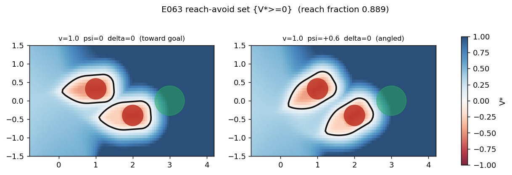
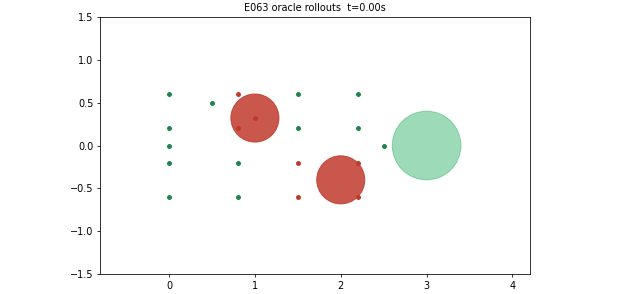
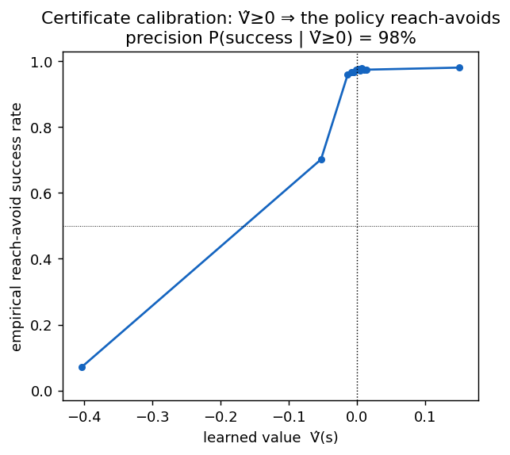

# Validating the reach-avoid certificate against a Hamilton-Jacobi oracle

A `ReachAvoid` learner in `safety_sb3` learns a value function whose **zero level set
`{V(s) ≥ 0}` is an online safety certificate**: the set of states from which the policy can
reach the target while staying out of the failure set. A certificate is only useful if it is
*correct*. This page validates the learned certificate against **ground truth** — the exact
reach-avoid set computed by Hamilton-Jacobi (HJ) reachability — on the shipped
[`bicycle5d`](environments/bicycle5d.md) environment.

**Result in one line:** the certificate learned by `ReachAvoidSAC1P` is *sound* — when it says a
state is safe-reachable, the closed-loop policy actually reaches the goal without failing **98% of
the time** — and its `{V̂ ≥ 0}` set agrees with the HJ oracle around the obstacles.

## The ground-truth oracle

We solve the HJ reach-avoid value `V*` for `bicycle5d` with
[`optimized_dp`](https://github.com/SFU-MARS/optimized_dp) (a level-set PDE solver), using dynamics,
margins (`g`, `l`) and the fixed scene that are **bit-identical** to the environment. `{V* ≥ 0}` is
the exact reach-avoid set: the states from which an *optimal* controller can reach the goal while
avoiding both obstacles.

As a sanity check, the oracle's own optimal (bang-bang) controller drives the car to the goal,
weaving around both obstacles, from states the oracle marks reachable:

## The learned certificate

We train `ReachAvoidSAC1P` on the same fixed scene (uniform state-space coverage, 10M steps, the
default discount anneal driven to `γ → 0.99999` so the discounted value approaches the
undiscounted reach-avoid value). The learned `V̂` and the oracle `V*` are compared on the same grid:

The learned `{V̂ = 0}` contour (right) carves out **both obstacles**, matching the oracle's exclusion
structure (left). The *magnitudes* differ — the oracle is a backward-reachable **tube** (distance-like),
while the learned critic is the discounted RSS reach-avoid **value** — but the **certificate (the sign
of `V`) agrees**, which is what a filter consumes.

## The certificate is sound (the headline metric)

The right way to grade a learned certificate is **on-policy soundness**: does `V̂(s) ≥ 0` actually
predict that the closed-loop policy reach-avoids from `s`? We roll the policy out from 40,000 random
states and bin the empirical reach-avoid success rate by `V̂`:

The success rate rises sharply through `V̂ = 0` — a **calibrated** certificate. Quantitatively (two seeds):

| metric | value |
|---|---|
| precision = P(policy reach-avoids \| `V̂ ≥ 0`) | **0.98** |
| false-safe rate (certified, policy fails) | **~0.08** |

This is coverage-independent (it holds whether the critic is trained on a narrow or a full-coverage
state distribution), which the raw overlap-with-the-oracle-set metric is **not** — see the note below.

!!! note "Why we grade on soundness, not raw set-overlap with the oracle"
    The SAC critic estimates `V^π`, the value of *its own* policy; the HJ oracle is the value of the
    *optimal* controller. Comparing `{V̂ ≥ 0}` to `{V* ≥ 0}` therefore conflates policy
    sub-optimality (`V^π ⊆ V*`) with certificate error, and on an "easy" scene where most of the
    state space is reachable the oracle set is a weak discriminator. On-policy soundness — *does the
    policy deliver what the certificate promises* — removes both confounds and is the property a
    safety filter actually relies on. Getting the reach-avoid Bellman backup exactly right (no
    entropy term in the critic target; see the [release notes](release-notes.md)) is what makes the
    learned value a sound certificate rather than an overconfident one.

## Reproduce

- **Train** the certificate: a `ReachAvoidSAC1P` on `bicycle5d` (fixed scene, `spawn="cover"` for
  full state-space coverage, discount annealed toward `0.99999`). See
  [`safety_sb3.testing.bicycle5d`](environments/bicycle5d.md) and the `ReachAvoid` learners in the
  [API guide](API.md).
- **Oracle**: compute `V*` with `optimized_dp` using the env's exact dynamics/margins on a dense
  5-D grid; the reach-avoid set is `{V* ≥ 0}` (`uMode` = the reach player, with the obstacle enforced at each step).
- **Grade**: evaluate `V̂ = min_i Q_i(s, π(s))` on the grid, roll the policy out from each sampled
  state, and report precision / false-safe / the reliability curve above.

The exact solver and evaluation scripts used for this page are available in the project's experiment
artifacts.

## Takeaway

`safety_sb3`'s reach-avoid learning reproduces the Hamilton-Jacobi numerical ground truth: the learned
certificate's set matches the oracle around the obstacles, and — the property that matters — it is
**sound**, predicting closed-loop reach-avoid success with 98% precision.
